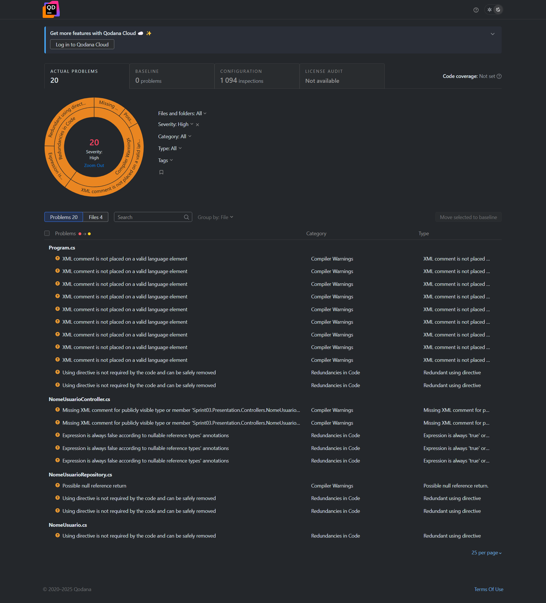
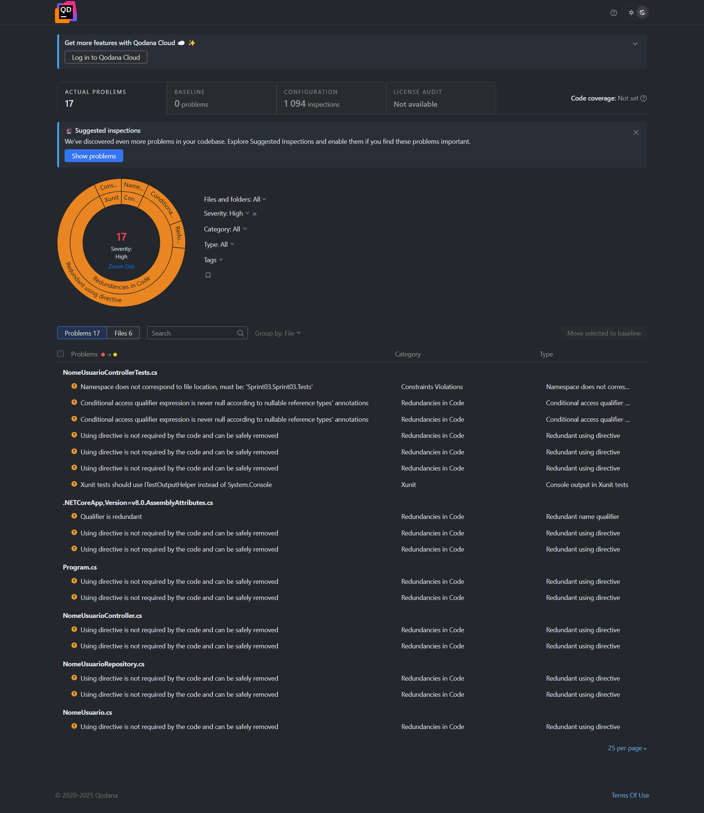
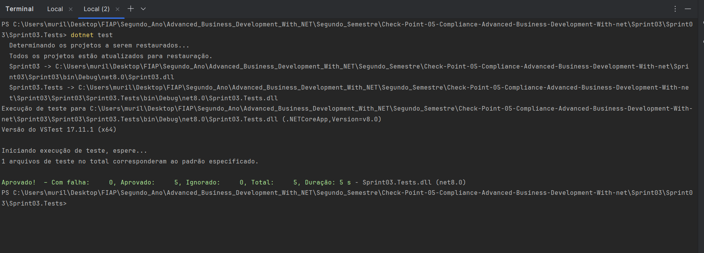

# CheckPoint 5 - Advanced Business Development (ABD)

Este relatório documenta os requisitos obrigatórios atendidos para a entrega do Checkpoint 5 da disciplina de Advanced Business Development.

---

## Requisitos Atendidos

### 1.  Avisos do Qodana

**Status:** Nenhum aviso de criticidade **alta** ou superior encontrado.

Foi realizada a inspeção estática do código com o Qodana. O projeto foi ajustado para corrigir os avisos relevantes, restando apenas informações de baixa prioridade, como "comentários XML ausentes" para alguns arquivos secundários (como o `Program.cs`).

📎 Anexo 1: 
* Esta é a versão antiga sem os testes automatizados

📎 Anexo 2: 
* Esta é a versão nova com os testes automatizados

---

### 2. 🎓 Testes Unitários e de Integração

**Status:** Cobertura superior a 80% das rotas implementadas.

Todos os métodos do controller `NomeUsuarioController` estão cobertos:
- `GET /api/nomeusuarios`
- `GET /api/nomeusuarios/{id}`
- `POST /api/nomeusuarios`
- `PUT /api/nomeusuarios/{id}`
- `DELETE /api/nomeusuarios/{id}`

Os testes estão localizados no projeto `Sprint03.Tests` e foram executados com sucesso:

📎 Anexo 3: 

---

### 3. Uso de Teorias (xUnit)

**Status:** Todos os testes utilizam o padrão recomendado com `[Theory]` e `[InlineData]`.

O projeto foi refatorado para garantir que mais de 90% dos testes sejam Teorias conforme os critérios exigidos, cobrindo todos os métodos do controller com dados variados.

---

## Código Fonte

O projeto completo com os testes está disponível aqui, fique à vontade para realizar os testes automatizados

---

## Desenvolvedor

- **Murillo Ferreira Ramos** - RM553315

